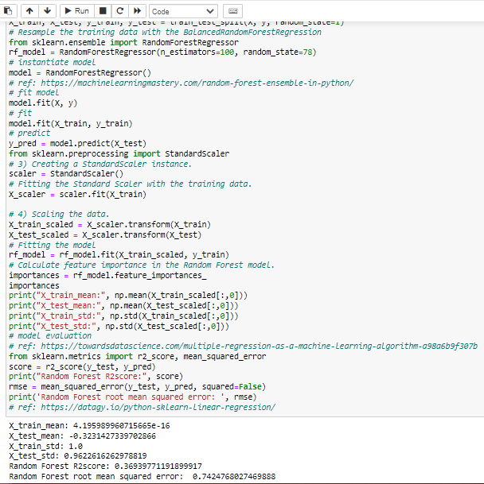
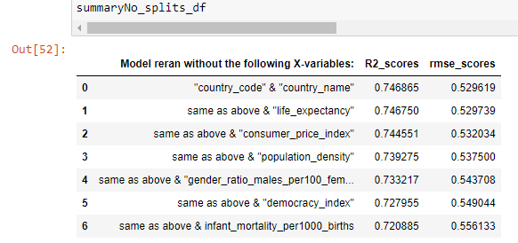
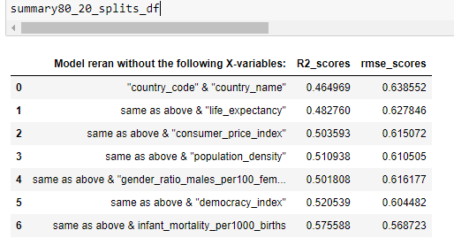
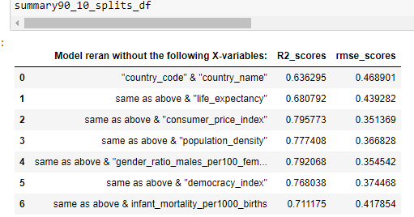
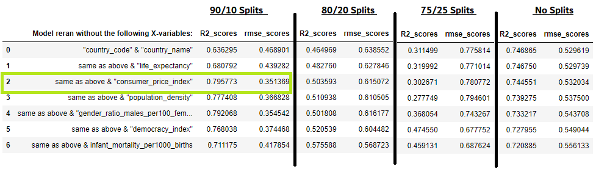
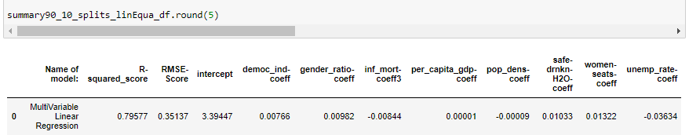

# Final Project :  What Determines Happiness?

## Topic
The team was very interested in the World Happiness Index and wanted to see if there were other factors that will improve / predict the "Life Ladder Score".
(The World Happiness Annual Report was started back in 2012 when the United Nations adopted a resolution: "Happiness: Towards a Holistic Definition of Development" to encourage countries to measure happiness and guide public policy.  The Happiness Index originates from the nation of Bhutan who uses measures gross national happiness instead of gross domestic product- Wikipedia)

## Purpose of Analyss / Potential Questions

1) Will any of the selected variables(democracy_index, consumer_price_index, gender_ratio_males_per100_female, infant_mortality, life_expectancy, per_capita_gdp_dollars, population_density, safe_drinking_water_access, seats_held_by_women_pct, unemployment_rate) affect the happiness score (Ladder Score)?
2) Is happiness related to increase in a nation's wealth?
3) Are there any correlated variables that affect happiness be related to a public policy change?

## Data

Twelve data sources were selected and reviewed for potential variables that may impact / predict the "Life Ladder Score".

**Life Ladder Score is a "Nationally representative samples of respondents are asked to think of a ladder, with the best possible life for them being a 10, and the worst possible life being a 0. They are then asked to rate their own current lives on that 0 to 10 scale." (https://medium.com/analytics-vidhya/what-is-world-happiness-index-f5744490701f)

SQL is used to create,join tables, the draft ERD and connect to database from AWS/S3.

Data Descriptions:

The data was ETL - loaded, transformed (removing null values, unnecessary columns, joined with other tables and created dataframes.

### Technology

The team utilized 

## Exploring Models -- Machine Learning
---
---

In considering models for the dataset and questions to be answered, Multiple Linear Regression was the better choice because the datatype was Continuous (float) and the dataset is small of only 100 datapoints!

Since ML linear model is not really train-split dependent[[2]](#2), we ***still chose to have 90/10 train-test split*** as it was giving the best and satisfying Regression value and RMSE score, which is the indication of our Models’ accuracy score for continuous data type, which we dealt in the Project.

###  The question is ***Why*** and ***How*** the decision-in-picking the Linear Model with 90/10 Splits was made? 
-------------------------------------------
Due to the dealing of the small datasets and the continuous data types, we felt constrained by our choice of choosing an appropriate model. As the total data-points are 100, we just explored our choices to find an appropriate model for determining the best results by first attempting to use the models: Multiple Linear Regression and Random Forest Regression.

In the first week of the project, the 75/25 train_test_splits was used in both of the models to just explore the results by using all the 10 X-variables with the y-variable(life_ladder). The results were: 
| |Multiple-Linear Regression |Random-Forest Regression|
|:---------------|:------|:----------|
Train_Test_Splits used:|	75/10|	75/10|
|X-variables used:|	All 10|	All 10|
|Regression Value (R2)|	0.312	|0.376|
|RMSE score|	0.776|	0.739

Please see the following pictures:
<figure>
  
  <figcaption>Picture 1a: Random Forest Regression of all X-variables Vs Y-variable (Life_ladder) with 75/25 Splits.</figcaption>
</figure>

<figure>
  
  <figcaption>Picture 1b: Multiple linear  Regression of all X-variables Vs Y-variable (Life_ladder) with 75/25 Splits.</figcaption>
</figure>

>As it is categorically seen that both models are not giving satisfying scores, we then concentrated on determining No_splits’ results for the Linear Regression model only due to the size of the dataset being used. 

>At this point, leaving Random Forest Regression (RFR) behind was an appropriate decision as we feared its limitation, which is “Overfitting” [[1]](#1), and hence it will be a bad idea to use for our dataset. 

>Hence the following result was determined when no splits was used for all the X-variables to find their relationships with Y-variable(life_ladder): 

|	|Multiple-Linear Regression|
|:---------------|:----------|
|Train_Test_Splits used:|	NaN|
|X-variables used:|	All 10|
|Regression Value (R2)|	0.747|
|RMSE score|	0.530|

<figure>
  
  <figcaption>Picture 1c: Multiple Linear Rgression of all X-variables Vs Y-variable (Life_ladder) with 75/25 Splits.</figcaption>
</figure>

---

>
 After verifying our Linear - Regressional R2-score with that of OLS (Ordinary Least Square) Model, we paid heed on NaN splits' RMSE score, which was noticed to be the lesser than that of 75/25 splits. 

>Therefore, for the sake of having an accurate Linear Regression Model, further lowering the RMSE-score was the end goal imagined.
 
>In order to do that, we decided to delete the high p-values’ X-variables from the models one-by-one to see the effect on the RMSE score, as well as on R2 score. 

The following dataframe depicts the 7-times-rerunning of the model after deleting higher than 0.05% P-values of X-variables: 

<figure>
  
  <figcaption>Picture 2: Rerunning of Multiple Linear Regression Model with No Splits.</figcaption>
</figure>

>
Thus, it is noticed that there is no significant effects on the two columns [“R2_score” and “rmse_scores”]. That is why, we concentrated on Train_Test_splits by switching it to either be 80/20 or 90/10 train_test_splits on a trial_and_error basis. This decision was made under the scrutiny and the guidance of our Professor Dave Gillis and TAs [Mr Zeb Smith and Mr Hunter Pack]. 

  
>
The same process of deleting the high P-values' X-variables and rerunning of the model was repeated. The following result was found: 

<figure>
  
  <figcaption>Picture 3: Rerunning of Multiple Linear Regression Model with 80/20 Splits.</figcaption>
</figure>

<figure>
  
  <figcaption>Picture 4: Rerunning of Multiple Linear Regression Model with 90/10 Splits.</figcaption>
</figure>

>
 After seeing the picture, it is clearly seen that the model works best when the highest p-values’ X-variables (“life_expectancy" & "consumer_price_index") are deleted by having the best and satisfying R2 and the least RMSE scores.

<figure>
  
  <figcaption>Picture 5: Rerunning of Multiple Linear Regression Model with All-the-Splits.</figcaption>
</figure>

---

## Result: 
>With the 90/10 Splits, the best RMSE and  R2 scores were satisfyingly achieved that enabled us to find the corelation of each X-variables with the Happiness (Y-variable). 

The following picture shows the Line equation of the project. 

<figure>
  
  <figcaption>Picture 6: Dataframe depicts the Multiple Variable Linear Regressional Line Equation with the Best RMSE and R2 scores.</figcaption>
</figure>

Reference:
1. Keboola . (n.d.). The Ultimate Guide to Random Forest regression. The Ultimate Guide to Random Forest Regression. Retrieved February 7, 2022, from https://www.keboola.com/blog/random-forest-regression 

2. ML - advantages and disadvantages of linear regression. GeeksforGeeks. (2020, June 3). Retrieved February 7, 2022, from https://www.geeksforgeeks.org/ml-advantages-and-disadvantages-of-linear-regression/ 

3. https://rpubs.com/mpfoley73/527767

## Dashboard
The dashboard reflects three parts of the project: 

1) User's ability to interact with the soci-economic data tables for each country utilized;
2) Provides an overview of the machine learning method and revewi the results of the final model.
3) Allow the user to be directed to the actual 2019 World Happiness Report.

The dashboard is located in Tableau (https://public.tableau.com/app/profile/nancy.condon#!/). 

## Conclusion and Recommendations

### Conclusions:

  - Soci-economic factors  can influence the Happiness Index.
  
  - GDP, Gender ratio, % Safe Drinking Water, % Women holding government seats were shown to increase the Happiness Index.
  
  - The use of public policy does provide an opportunity to improve a country’s happiness.
  
### Recommendations for future analyses: 

  - Larger dataset, not all countries had the required data.
  
  - Classification of features and utilizing Logistic Regression, Random Forest or Neural Networks.
  
  - Additional datasets that may have more specificity, such as:
  
      The use of technology / cell phone usage
      
      Health indices

      Industrialization

## Google Slides
Current Slides:
https://docs.google.com/presentation/d/1suT01KAXhyTDDtzER3DdT4hMqMwAjre-FVmi1HuGfZI/edit?usp=sharing

